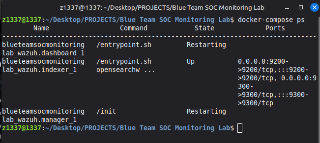
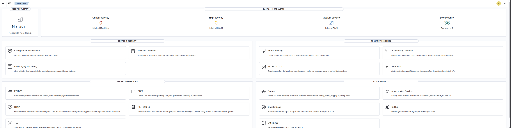
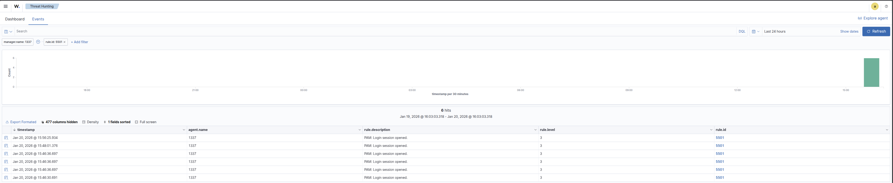

# Blue Team SOC Monitoring Lab

## Project Overview

This project demonstrates a hands-on Security Operations Center (SOC) monitoring environment. I deployed a **Wazuh SIEM** (Security Information and Event Management) stack to monitor a Linux host, simulated a **brute-force authentication attack**, and analyzed the resulting security alerts to understand threat detection workflows.

### Key Objectives

* **SIEM Deployment:** Installed and configured the Wazuh manager, indexer, and dashboard.
* **Log Aggregation:** Configured host-based monitoring to ingest system authentication logs (`/var/log/auth.log`).
* **Attack Simulation:** Developed a Python script to generate realistic failed authentication attempts.
* **Threat Analysis:** Analyzed SIEM alerts to identify attack patterns and successful/failed login attempts.

---

## Technical Architecture

* **SIEM Platform:** Wazuh (Manager, Indexer, Dashboard)
* **Monitoring:** Host-level log collection via Wazuh native installation
* **Automation:** Python 3 (Attack Simulation)
* **Environment:** Linux Mint (Ubuntu-based)

---

## Lab Execution & Evidence

### 1. Infrastructure Setup

The Wazuh stack was successfully deployed and initialized. All core services (Manager, Indexer, and Dashboard) are running and communicating correctly.

### 2. SIEM Access

The Wazuh Dashboard provides a centralized interface for monitoring security events across the infrastructure.

### 3. Attack Detection

I executed a custom Python script (`brute_force_simulator.py`) to simulate a brute-force attack against the host. Wazuh's rule engine successfully detected the "Multiple failed logins" pattern and generated real-time security alerts.

---

## Security Analysis

During the simulation, Wazuh detected several critical event types:

* **Rule ID 5501:** PAM: Login session opened.
* **Rule ID 5502:** PAM: Login session closed.
* **Rule ID 5402:** Successful sudo to ROOT executed.
* **Rule ID 5712:** SSHD brute force detection (triggered by multiple failed login attempts).

This demonstrates the ability to differentiate between normal administrative behavior and potential malicious activity.

---

## Tools & Files

* `brute_force_simulator.py`: Python script used to simulate authentication attacks.
* `docker-compose.yml`: Infrastructure-as-Code for the Wazuh stack deployment.
* `setup.sh`: Automated setup and certificate generation script.

---

## Learning Outcomes

* Hands-on experience with enterprise-grade SIEM platforms.
* Deep understanding of security event correlation and rule-based detection.
* Proficiency in Linux security log analysis and system administration.
* Ability to communicate technical security findings through professional documentation.
